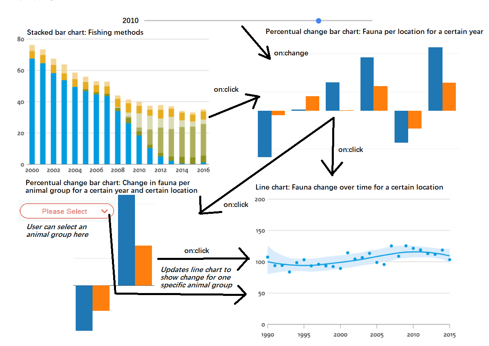

# project
Visualizing the impact of harmful fishing methods on fauna in the North Sea

## Description
In the last three decades, ecosystems in the North Sea have been under a lot of pressure. The main reason are destructive fishing methods such as beam trawling, in which large nets drag over the ocean floor. This damages flora on the ground and produces large amounts of bycatch. Such that ecosystem equilibriums are tipped out balance, which causes the total fauna and its components to change. This project aims to visualize the links between the fishing methods that were used coupled with the change in fauna for four different locations in the North Sea.

## Design

### Main features
* Four graphs
* On click of a bar in the top-left graph OR on change of the slider will trigger the top-right graph to change and show data for a certain year across all location
* On click on a location in the top-right graph will trigger the graphs on the bottom-left showing the fauna change per animal group, as well as the graph on the bottom-right showing the total fauna change over time
* The graph on the bottom-left has a select dropdown in which the user can choose an animal group which updates the chart on the bottom-right to show the change in the prevalence of that animal group in that location
