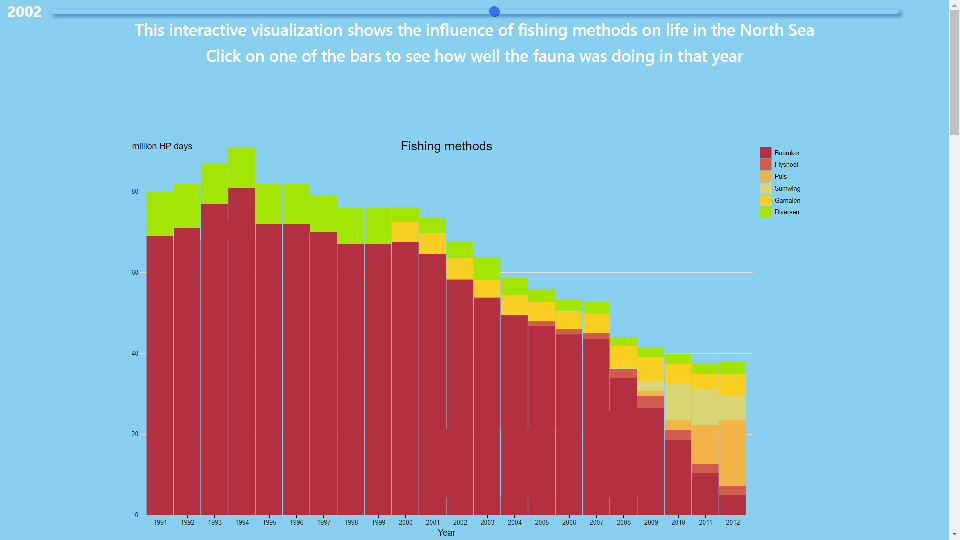
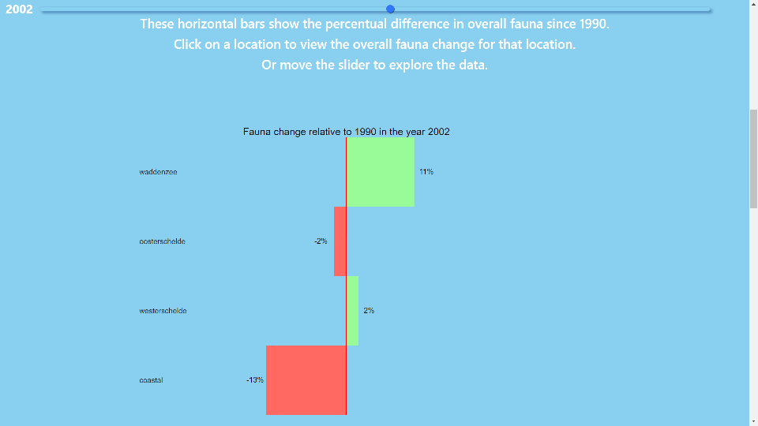
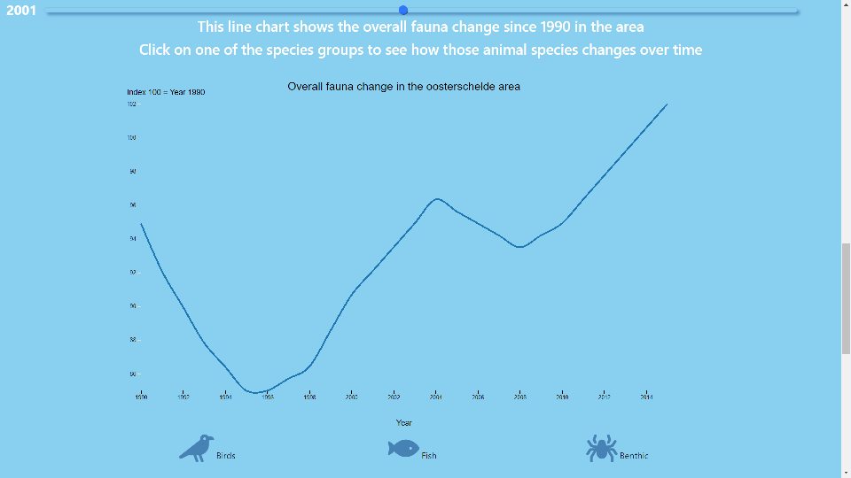
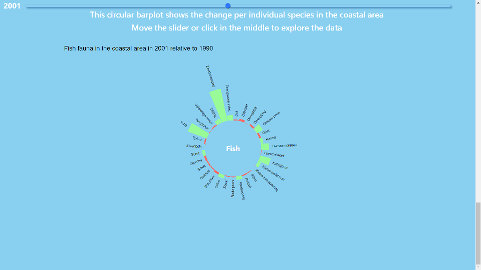

# Project
Visualizing the impact of harmful fishing methods on fauna in the North Sea

Author: Max Frings

## Purpose
In the last three decades, ecosystems in the North Sea have been under a lot of pressure. The main reason are destructive fishing methods such as beam trawling, in which large nets drag over the ocean floor. This damages flora on the ground and produces large amounts of bycatch. Such that ecosystem equilibriums are tipped out balance, which causes the total fauna and its components to change. This project aims to visualize the links between the fishing methods that were used coupled with the change in fauna for four different locations in the North Sea.

### Main features
* Four interlinked graphs:
A stacked bar chart that shows the fishing methods
A horizontal bar chart which shows the change in overall fauna per location
A line chart which shows the overall fauna change over time in a certain location
A circular bar chart which shows the fauna change for a single species in a certain location

The graphs appear in this order in the webpage, with each graph and the corresponding information surrounding it taking up exactly one full page. The idea is that the user starts at the first graph, and then every graph has an event listener in which the user can click on a certain part of the information it wants to dive deeper into, with smooth transitions in between graphs. In the first graph, the user is presented with all the fishing methods used in the North Sea and can click on one of the bars.

This will cause the website to transition to the horizontal bar chart in which the user sees the fauna change for the year that it just selected.

Then the user can select one of the horizontal bars to zoom in on that location, the user is now presented with the total fauna change in that location.

At last the user can choose an animal species in that location, and then transitions to the last graph in which the horizontal bar chart is shown in which the user can see the fauna change per individual species.

The README.md should also acknowledge sources of external code, images and other materials that are in the repository but not created by yourself. Make sure that it is clear which directories are copyrighted by different creators.

Also note that these materials have their own respective licenses. You should at the very least note this fact (again, in the README.md). Make sure you also check the licenses to see if you should make a special statement about the source of the materials.
