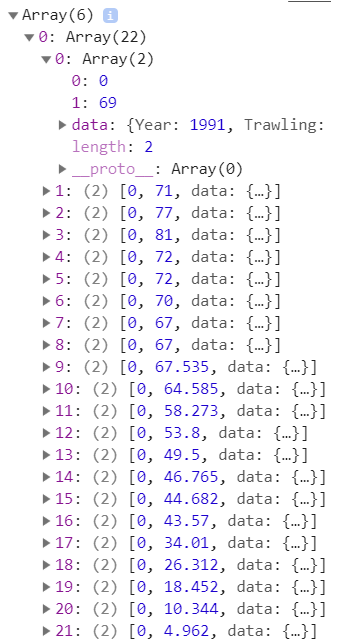

"""
Create a report (REPORT.md), based on your design document, containing important decisions that you’ve made, e.g. where you changed your mind during the past weeks. This is how you show the reviewer that you actually understand what you have done.

Start with a short description of your application (like in the README.md, but very short, including a single screen shot).

Clearly describe the technical design: how is the functionality implemented in your code? This should be like your DESIGN.md but updated to reflect the final application. First, give a high level overview, which helps us navigate and understand the total of your code (which components are there?). Second, go into detail, and describe the modules/classes (apps) files/functions (data) and how they relate.
"""

## Description
This data visualization project shows how fishing methods in the North Sea affected bird, fish and benthic fauna in different locations.

## Technical design

The flowchart above gives a high level overview of this project. Firstly, a collection of CSV datasets are merged and transformed to 4 JSON files. The JS file loaddata.js loads these 4 JSON files, from this JS file, all the other JS files are called which each initialize a graph. Then the file loaddata.js binds all the event listeners to all HTML and SVG elements in the project to make all graphs interactive with each other.

## Description of JavaScript files

### loaddata.js
Loads all the JSON files and binds all the event listeners to HTML and SVG elements.
Calls all initialization methods of the other JS files.

### stackedbarchart.js
This file creates the stacked bar chart that shows the fishing methods using one function:
initializeMethods()

### horizontalbarchart.js
This file contains two functions, initializeHorizontalBars() creates the horizontal bar chart at the start and updateBars() updates the graph.

### linechart.js
This file contains two functions, changeLine() creates the line chart at the start and updateLineHeight() updates the graph.

### circularbarchart.js
This file contains two functions, initializeBars() creates the circular bar chart at the start and updateCircular() updates the graph.

"""
Clearly describe challenges that your have met during development. Document all important changes that your have made with regard to your design document (from the PROCESS.md). Here, we can see how much you have learned in the past month.

Defend your decisions by writing an argument of a most a single paragraph. Why was it good to do it different than you thought before? Are there trade-offs for your current solution? In an ideal world, given much more time, would you choose another solution?

Make sure the document is complete and reflects the final state of the application. The document will be an important part of your grade.
"""

## In-depth overview
A total of 13 CSV datasets and 1 scientific report from the Wageningen University were collected for this project. All data was then transformed to JSON formats using multiple python scripts in order to get the right format for each JSON file. The project consists of 4 different interactive graphs, and each of these graphs takes one JSON file. The JSON files are first loaded in through a JS file called loaddata.js

### loaddata.js
This file loads in all the JSON data and binds all the event listeners to all relevant HTML elements. The file starts off with a promise function  that loads in all JSON files, after they are successfully loaded, they are put into 4 JS objects. Every object is then passed to the initialize function of its corresponding graph. I decided to create a separate file for loading all the data and binding all the event listeners for two reasons: Firstly, it keeps the JS files neat and short, it makes the project structure easier to understand. Secondly, when all JSON objects are loaded in one file, then that file can be used to call all initialize methods and to bind all event listeners with the datasets to HTML elements. This way, you don't have to make any data global since this is the only file that needs to access the datasets.

The first two event listeners that are bound are the two select elements to select different species and a different location, which both call the circular bar chart update function whenever their value changes.
The third event listener is bound to the stacked bar chart, whenever the user clicks the horizontal bar chart and the circular bar chart update to the given year, as well as the HTML slider as an element next to the slider that displays the slider value. The fourth event listener is bound to the slider, whenever the user provides input to the slider the horizontal bars and the circular bar chart are updated again, as well as the display slider value. The fifth event listener is bound to the horizontal bar chart, whenever a user clicks on one of the bars (a location), the line chart and the circular bar chart update themselves for that location. Also a smooth scroll animation was added that moves the user to the next graph. Lastly, both the line chart and the circular bar chart have an HTML span element in their header that shows the location, this span element is selected and updated as well.
The sixth and seventh event listener were added because of a design decision that I made. They are both added to elements of the horizontal bar chart. It came to my attention that whenever one of the values in the horizontal bar chart was 0, there was no bar to press on, thus no way for the user to progress to the next graph. That's why these two event listeners are bound to the labels and tick marks of the horizontal bar chart, which have the same effect as if the user were to click on one of the bars. Then three event listeners are defined on three animal icons that are presented in the line chart, at this point the user is asked to select an animal species in that location in which it will present the user that increase or decline for the animals belonging to that animal species group. Thus every icon has an on click event listener that updates the circular bar chart for that given animal species group. Before we continue looking into the other JS files, it is important to understand the structure of the index.html file.

### index.html
This is where all the magic is displayed to the user. It is important to understand how the HTML was structured in order to understand all the other JS files. For this project Bootstrap was used to create a responsive and easy-to-style website using the grid system. The structure that was used for all 4 graphs is as follows:

~~~

  <h3>
    [text describing this graph]
  </h3>

  

    

      <svg></svg>
    

  

~~~

There is a div container at the top of every graph which contains a h3 header which gives background information and describes the graph.

Below that there is another div container, which has a div row inside, which contains a div taking up the full width (12 columns) of the Bootstrap columns, in which the SVG is added.

In the CSS file, the height of the outer container of the text and the SVG were chosen as such that they together make up a height of 100%, so that the user is always display with one and only one graph at a time. The text container takes up around 30% for most graphs while the SVG container takes up around 70% for a nice balanced layout. Furthermore the container class was chosen for its default margins at the sides of the page, leaving some room which also improves the design of the page.

After the initialisation of these HTML elements, all the script tags which contain the JS files are loaded below, this way we don't need extra window.onload functions in the JS files and can be sure that all HTML elements we are trying to access through the DOM exist at the point when the JS files are executed.

### stackedbarchart.js
This chart shows the fishing methods that were used in the North Sea throughout the years 1991 - 2012.
Since this is the only static chart of the project, it only needs one main function that is called once when all the data is loaded using the function initializeMethods(). At the start of this function every fishing method is transposed into a single layer using d3's stack() function:

Above is shown what the data looks like after the stack() function, there are 6 arrays, one for every fishing methods, which has 22 arrays inside, one for every year, which contains the starting y coordinate (0) and the end y coordinate (1). Inside this array there is also an object called data in which the year value can be accessed using the key 'Year'.

The width and height are then chosen by selecting the innermost div surrounding the SVG and requesting its width and height, subtracting a slight margin to keep room for titles, axes labels and a legend. Then the x and y scale are set, colours are defined for every fishing method. The axes are added, as well as a single rectangle for every fishing method for every year and filled with their corresponding colours. Furthermore every rectangle gets mouseover, mouseout and mousemove attributes to track the mouse location and to show a tooltip whenever the mouse hovers over the rectangles. A legend was created to show which colour corresponds with which fishing methods, all elements in the legends are then given a link attribute so the user can click on any fishing method in the legend and is then presented to an external website with more information about that fishing method.

### horizontalbarchart.js
This chart shows the overall fauna for four different locations relative to 1990 throughout the years 1991 - 2012. This file has two functions, one to initialize the chart `initializeHorizontalBars()` and another one to update it `updateBars()`. 

## Sources
https://www.clo.nl/indicatoren/nl0587-visserijtechnieken
https://www.clo.nl/indicatoren/nl1599-fauna-westerschelde
https://www.clo.nl/indicatoren/nl1598-fauna-oosterschelde
https://www.clo.nl/indicatoren/nl1597-fauna-wadden
https://www.clo.nl/indicatoren/nl1596-fauna-noordzee-kustzone
http://edepot.wur.nl/284011
