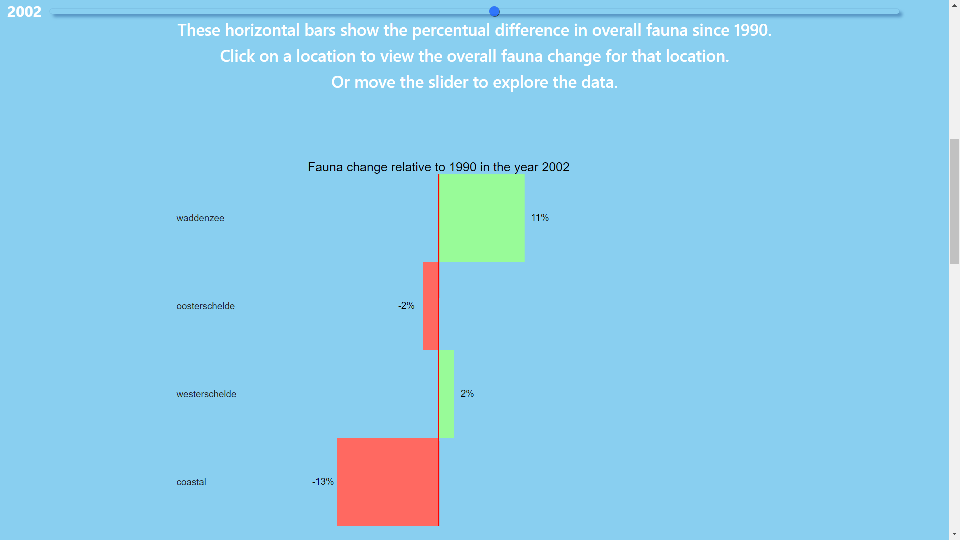
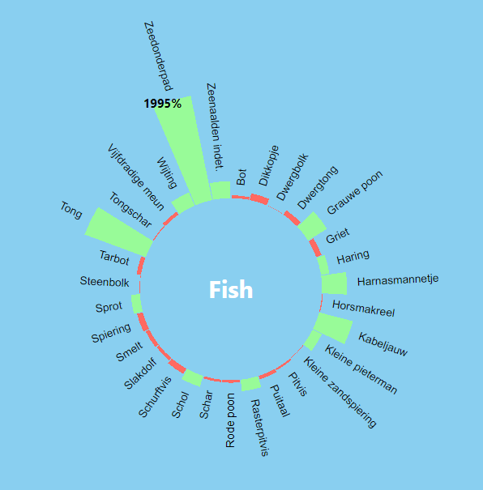

## Description
This data visualization project shows how fishing methods in the North Sea affected bird, fish and benthic fauna in different locations.

This first graph shows the fishing methods that are used in the North Sea.

The second graph shows the fauna change per location for a certain year.

The third graph shows the fauna change for a certain location for all years.

The fourth graph shows the fauna change per individual species group for a certain location for a certain year.

## Technical design

The flowchart above gives a high level overview of this project. Firstly, a collection of CSV datasets are merged and transformed to 4 JSON files. The JS file loaddata.js loads these 4 JSON files, from this JS file, all the other JS files are called which each initialize a graph. Then the file loaddata.js binds all the event listeners to all HTML and SVG elements in the project to make all graphs interactive with each other.

## Overview of JavaScript files

### loaddata.js
Loads all the JSON files and binds all the event listeners to HTML and SVG elements.
Calls all initialization methods of the other JS files.

### stackedbarchart.js
This file creates the stacked bar chart that shows the fishing methods using one function:
initializeMethods()

### horizontalbarchart.js
This file contains two functions, initializeHorizontalBars() creates the horizontal bar chart at the start and updateBars() updates the graph.

### linechart.js
This file contains two functions, changeLine() creates the line chart at the start and updateLineHeight() updates the graph.

### circularbarchart.js
This file contains two functions, initializeBars() creates the circular bar chart at the start and updateCircular() updates the graph.

## Important changes, challenges, trade-offs

One major change was that my initial design was a data visualization which could be seen in a single screens width and height. However, it soon became clear the charts would be too small and there would be no room to add text to tell a story about the visualization. That's why I decided to take another approach by giving every chart a full screens width and height and added text to tell a story. I also added clickable elements in every graph which creates a smooth transition to the next graph, in which the user can keeping zooming in on a part of the data and get to know more.
One trade-off that comes to mind is that the user is not able to see the fishing method stacked bar chart in combination with the other graphs. So it might be a bit more difficult to directly see how different fishing methods affect the fauna. But therefore I added extra background information that makes it easier, and also the user can simply scroll back up if they want to check the fishing methods stacked bar chart again.

Another change is the relative bar chart that shows the fauna change per location. In my original design the bars are oriented vertically, but in my final project the bars are oriented horizontally. I partly did this because I already had experience with placing bars vertically and wanted an extra challenge by placing the bars horizontally, which creates some extra difficulty as described below in the in-depth section. I don't think one or the other is more clear, they serve the same purpose. A horizontal bar chart just looks cooler.

The line chart as well as my stacked bar chart are my solid rocks within the project, they didn't change. They are awesome and serve their jobs well, that is to present the data in an easy-to-understand manner. I added some more fanciness though, like a tooltip per fishing method in the stacked bar chart, and a line tooltip in the line chart. Another change that I made later was to add links in the legend of the fishing method stacked bar chart so that when the user presses on one of the fishing methods in the legend it will take the user to a website with more information about that fishing method.

Lastly, another major change was that instead of showing another relative change bar chart for the species in a certain location, I decided to change this for a circular bar chart. The circular bar chart allows the user to seethe relative change for all animals in a certain year and location belonging to a certain group. If I were to choose another relative change bar chart instead, I would not have enough room to show every single animal species and instead would be only able to show the total fauna change per group in a certain year and location, without splitting the group up in all the sub groups. The radial characteristics of the circular bar chart help to display a lot of data on the screen at once, since a lot of bars fit on the screen that way. Another change that I made, after I decided that I was going to use the circular bar chart, was the position of my select element. I added a select element so that the user could select a species and view the change for that species. The position of this element used to be at the bottom of the page. However with a lot of CSS flexbox magic and absolute positions and select element styling I managed to get a really cool effect in which the current selection displays in the middle of the circular bar chart as such:

I did face many challenges with the circular bar plot, it was difficult to get all the paths in their correct position, as well as updating them gracefully. But the one who perseveres succeeds in the end, or dies a perseverer. Is that a word?

## In-depth overview
A total of 13 CSV datasets and 1 scientific report from the Wageningen University were collected for this project. All data was then transformed to JSON formats using multiple python scripts in order to get the right format for each JSON file. The project consists of 4 different interactive graphs, and each of these graphs takes one JSON file. The JSON files are first loaded in through a JS file called loaddata.js

### loaddata.js
This file loads in all the JSON data and binds all the event listeners to all relevant HTML elements. The file starts off with a promise function  that loads in all JSON files, after they are successfully loaded, they are put into 4 JS objects. Every object is then passed to the initialize function of its corresponding graph. I decided to create a separate file for loading all the data and binding all the event listeners for two reasons: Firstly, it keeps the JS files neat and short, it makes the project structure easier to understand. Secondly, when all JSON objects are loaded in one file, then that file can be used to call all initialize methods and to bind all event listeners with the datasets to HTML elements. This way, you don't have to make any data global since this is the only file that needs to access the datasets.

The first two event listeners that are bound are the two select elements to select different species and a different location, which both call the circular bar chart update function whenever their value changes.
The third event listener is bound to the stacked bar chart, whenever the user clicks the horizontal bar chart and the circular bar chart update to the given year, as well as the HTML slider as an element next to the slider that displays the slider value. The fourth event listener is bound to the slider, whenever the user provides input to the slider the horizontal bars and the circular bar chart are updated again, as well as the display slider value. The fifth event listener is bound to the horizontal bar chart, whenever a user clicks on one of the bars (a location), the line chart and the circular bar chart update themselves for that location. Also a smooth scroll animation was added that moves the user to the next graph. Lastly, both the line chart and the circular bar chart have an HTML span element in their header that shows the location, this span element is selected and updated as well.
The sixth and seventh event listener were added because of a design decision that I made. They are both added to elements of the horizontal bar chart. It came to my attention that whenever one of the values in the horizontal bar chart was 0, there was no bar to press on, thus no way for the user to progress to the next graph. That's why these two event listeners are bound to the labels and tick marks of the horizontal bar chart, which have the same effect as if the user were to click on one of the bars. Then three event listeners are defined on three animal icons that are presented in the line chart, at this point the user is asked to select an animal species in that location in which it will present the user that increase or decline for the animals belonging to that animal species group. Thus every icon has an on click event listener that updates the circular bar chart for that given animal species group. Before we continue looking into the other JS files, it is important to understand the structure of the index.html file.

### index.html
This is where all the magic is displayed to the user. It is important to understand how the HTML was structured in order to understand all the other JS files. For this project Bootstrap was used to create a responsive and easy-to-style website using the grid system. The structure that was used for all 4 graphs is as follows:

~~~

  <h3>
    [text describing this graph]
  </h3>

  

    

      <svg></svg>
    

  

~~~

There is a div container at the top of every graph which contains a h3 header which gives background information and describes the graph.

Below that there is another div container, which has a div row inside, which contains a div taking up the full width (12 columns) of the Bootstrap columns, in which the SVG is added.

In the CSS file, the height of the outer container of the text and the SVG were chosen as such that they together make up a height of 100%, so that the user is always display with one and only one graph at a time. The text container takes up around 30% for most graphs while the SVG container takes up around 70% for a nice balanced layout. Furthermore the container class was chosen for its default margins at the sides of the page, leaving some room which also improves the design of the page.

After the initialisation of these HTML elements, all the script tags which contain the JS files are loaded below, this way we don't need extra window.onload functions in the JS files and can be sure that all HTML elements we are trying to access through the DOM exist at the point when the JS files are executed.

### stackedbarchart.js
This chart shows the fishing methods that were used in the North Sea throughout the years 1991 - 2012.
Since this is the only static chart of the project, it only needs one main function that is called once when all the data is loaded using the function initializeMethods(). At the start of this function every fishing method is transposed into a single layer using d3's stack() function:

Above is shown what the data looks like after the stack() function, there are 6 arrays, one for every fishing methods, which has 22 arrays inside, one for every year, which contains the starting y coordinate (0) and the end y coordinate (1). Inside this array there is also an object called data in which the year value can be accessed using the key 'Year'.

The width and height are then chosen by selecting the innermost div surrounding the SVG and requesting its width and height, subtracting a slight margin to keep room for titles, axes labels and a legend. Then the x and y scale are set, colours are defined for every fishing method. The axes are added, as well as a single rectangle for every fishing method for every year and filled with their corresponding colours. Furthermore every rectangle gets mouseover, mouseout and mousemove attributes to track the mouse location and to show a tooltip whenever the mouse hovers over the rectangles. A legend was created to show which colour corresponds with which fishing methods, all elements in the legends are then given a link attribute so the user can click on any fishing method in the legend and is then presented to an external website with more information about that fishing method.

### horizontalbarchart.js
This chart shows the overall relative fauna for four different locations relative to 1990 throughout the years 1991 - 2012. This file has two functions, one to initialize the chart `initializeHorizontalBars()` and another one to update it `updateBars()`. The initialize function takes two arguments: data and year. data is the whole dataset that is passed in from the loaddata.js file and year is the year that is selected for which to show the overall relative fauna change. The relevant data is then taken by selecting data[year] at the start of the function. In the same fashion as the graph above, the width and height are selected from the innermost div element surrounding the SVG, subtracting leaving some room for labels and titles by adding margins in all directions. Then x and y scales and a y axis is created. For every location a rectangle is appended. Since this a horizontal bar chart, it is a bit more complicated than letting a rectangle start at the bottom and then let the height be defined by its value. Instead we will make a line in the middle of the horizontal bar chart which represents 0% change. Then we have to calculate per location whether the bar should be on the left (negative change) or on the right of that line (positive change):

~~~
bars.append("rect")
.attr("x", function(d) {
  if (d.value - 100 >= 0) {
    return width / 2;
  } else {
    return width / 2 - x(100 - d.value);
  }
})
~~~

As you can see in the block of code above, the bar either stars in the middle of the SVG (width/2) when the fauna change is positive. Otherwise, it starts at the left side of the line when the fauna change is negative. Since we can not simply let all bars start in the middle and then give it a negative or positive width (negative width does not exist), the amount the bar is placed to the left of the line is calculated by starting at the middle, and then subtracting the amount of change, converted using the x scale. That way, for the width of the bar we can again use the amount of change converted using the x scale. All the bars that are negative now have their starting point left of the line and their width is now exactly the width that is needed to reach the line, representing a negative trend for that location:

~~~
.attr("width", function(d) {
  return x(Math.abs(100 - d.value));
})
~~~

Then we color all the positive change green and all negative change red:

~~~
.attr("fill", function(d) {
  if (d.value - 100 >= 0) {
    return "#98FB98";
  } else {
    return "#ff6961";
  }
});
~~~

The dividing line in the middle is made by appending a path to the SVG which goes from one pixel to the left of the middle to one pixel to the right of the middle, and starts at the first bar and ends at the last as such:

~~~
svg.append("path")
  .attr("d", " M " + (width / 2 - 1) + " " + y("waddenzee") + " L " +
    (width / 2 - 1) + " " + (height) + " L " + (width / 2 + 1) + " " +
    (height) + " L " + (width / 2 + 1) + " " + y("waddenzee") + " ")
~~~

The second function `updateBars()` is called whenever the user selects a different year. The way the update function works is by selecting all the horizontal bars, then going into the new data and set new x, width and fill attributes for all bars using a transition:

~~~
const horizontalBars = d3v5.selectAll(".bar")
  .data(locdata)
  .transition()
  .duration(100)
  .attr("x", function(d) {
    if (d.value - 100 >= 0) {
      return width / 2;
    } else {
      return width / 2 - x(100 - d.value);
    }
  })
  .attr("width", function(d) {
    return x(Math.abs(100 - d.value));
  })
  .attr("fill", function(d) {
    if (d.value - 100 >= 0) {
      return "#98FB98";
    } else {
      return "#ff6961";
    }
  });
  ~~~

  Then the labels are updated to show the new values in a similar fashion:

~~~
  d3v5.selectAll(".overallLabel")
    .data(locdata)
    .transition()
    .duration(100)
    .attr("x", function(d) {
      if (d.value - 100 >= 0) {
        return width / 2 + x(Math.abs(100 - d.value)) + 10;
      } else {
        return width / 2 - x(100 - d.value) - 40;
      }
    })
    .text(function(d) {
      return d.value - 100 + "%";
    });
~~~

And of course we should not forgot to update the SVG title so the newly selected year shows:

~~~
d3v5.select(".overallTitle")
  .text("Fauna change relative to 1990 in the year " + year);
~~~

### linechart.js
The line chart shows the overall fauna change over all years for a single location. It consists of two functions, one for initialization `changeLine()` and one for updating `updateLineHeight()`. Again, the width and height of the innermost div surrounding the SVG are selected, leaving some room for the title and axes labels using margins. Then the x and y scales and axes and domains are defined. The d3 line function is called in passing in the x and y values with their corresponding scales. A g element is added, in which a path is appended which will be the line of the chart, for its d attribute the line function that we defined earlier is called, it gets passed in all the values and gets returned:

~~~
.attr("d", function(d) {
  return line(d.values);
})
~~~

Then for the secret sauce of the graph, we are going to add a mouse tracker that will drag a vertical line along the graph wherever the mouse is, with a circle surrounding the value in the line with a tooltip next to it. In order to create this, we have to append a g element:

~~~
const mouseG = svg.append("g")
  .attr("class", "mouse-over-effects");
~~~

And then append the vertical line:

~~~
mouseG.append("path")
  .attr("class", "mouse-line")
  .style("stroke", "black")
  .style("stroke-width", "1px")
  .style("opacity", "0");
~~~

The circle surrounding the data point on the line:

~~~
mousePerLine.append("circle")
  .attr("r", 7)
  .style("stroke", function(d) {
    return color(d.name);
  })
  .style("fill", "none")
  .style("stroke-width", "1px")
  .style("opacity", "0");
~~~

The tooltip that will display text next to the circle:

~~~
mousePerLine.append("text")
  .attr("transform", "translate(10,3)")
  .attr("font-size", "12px")
  .attr("font-weight", "bold");
~~~

Now we have to append a rectangle that can track the mouse movement:

~~~
mouseG.append('svg:rect')
  .attr('width', width)
  .attr('height', height)
  .attr('class', 'mouseMove')
  .attr('fill', 'none')
  .attr('pointer-events', 'all')
~~~

Then mouseover and mouseout attributes are added to this rectangle, making the vertical line, circle and tooltip visible and invisible.

Then a mousemove attribute is added that is going to track the mouse location and put the vertical line, circle and tooltip in the correct position every time, changing the transform attribute of the circle and tooltip every time the mouse is moved:

~~~
.attr("transform", function(d, i) {
  const xDate = x.invert(mouse[0]),
    bisect = d3v5.bisector(function(d) {
      return d.date;
    }).right;
  idx = bisect(d.values, xDate);

  // Get length of line
  let beginning = 0,
    end = lines[i].getTotalLength(),
    target = null;

  // Check if mouse is between the line width
  while (true) {
    target = Math.floor((beginning + end) / 2);
    pos = lines[i].getPointAtLength(target);
    if ((target === end || target === beginning) && pos.x !== mouse[0]) {
      break;
    }
    if (pos.x > mouse[0]) end = target;
    else if (pos.x < mouse[0]) beginning = target;
    else break; //position found
  };

  // Set the position of the text
  d3v5.select(this).select('text')
    .text(y.invert(pos.y).toFixed(2));

  // Returns the new location
  return "translate(" + mouse[0] + "," + pos.y + ")";
});
~~~

For the update function `updateLineHeight()` start out the same way, initializing the width, height, domains and scales. Then the line function is set again using the new values. The update function for the line chart is then very simple, since the line is only defined as one big path element. We simply select the old path element and put in the new values, using a transition to make it look cool:

~~~
const nieuwelijn = d3v5.select(".line")
  .data(currentLocation)
  .transition()
  .duration(2000)
  .attr("d", function(d) {
    return line(d.values);
~~~

Damn that looks sick.

Then the special sauce that tracks the mouse is done again in the same way, except now we don't have to create the g elements again that track, make up the vertical line, circle and tooltip, we can simply select them since they already exit.

### circularbarchart.js
Saving the best for last, the circular bar chart. This chart displays the increase or decrease for all animals belonging to one of the species groups of birds, fish or benthic animals for a single location in a single year. Again this graph consists of two functions, initializeBars() and updateCircular(). Both functions take 4 arguments: data, location, year and species. And then at the beginning of the function the relevant data is selected as such: `circulardata[location][year][species]`. Then like all the other graphs, the width and height of the SVG are chosen by getting the width and height from the innermost div element surrounding the SVG. Then the x and y scale are defined. A g element is created, and then a path element is appended for every data point by entering into the data and then calling append. Since it's a circular bar plot, the d attribute of the path elements gets calculated using the d3 arc() function, in which the inner, pad and outer radius as well the start, pad, and end angle are calculated:

~~~
.attr("d", d3v5.arc()
  .innerRadius(innerRadius)
  .outerRadius(function(d) {
    return y(d['value']);
  })
  .startAngle(function(d) {
    return x(d.name);
  })
  .endAngle(function(d) {
    return x(d.name) + x.bandwidth();
  })
  .padAngle(0.01)
  .padRadius(innerRadius))
~~~

These paths also get mouseover, mouseout and mousemove attributes to show or hide the tooltip.

Then the labels are appended, the location and correct angle of these labels is calculated by converting all the locations to locations around the whole circle using Math.PI to calculate the correct position and transform:

~~~
attr("text-anchor", function(d) {
  return (x(d.name) + x.bandwidth() / 2 + Math.PI) %
    (2 * Math.PI) < Math.PI ? "end" : "start";
})
.attr("transform", function(d) {
  return "rotate(" + ((x(d.name) + x.bandwidth() / 2) * 180 / Math.PI - 90) +
    ")" + "translate(" + (y(d['value']) + 10) + ",0)";
})
~~~

The tooltip is created, as well as a legend to show that the green paths mean that there was an increase for that animal group and a red path means a decline.

The update function of the circular bar chart `updateCircular()` updates the title and sets new scales and redefines the tooltip by selecting the already existing one. But now it gets interesting, all the g element that contains the paths is selected and we are going to enter into the new data:

~~~
const newBars = d3v5.select(".barg")
  .selectAll("path")
  .data(data);
~~~

We call enter on the new data and append a path for every new datapoint, then we use merge to merge the new paths with the existing ones to update the bar chart:

~~~
newBars
  .enter().append("path").merge(newBars)
~~~

And then again use the d3 arc() function to update the d attribute for all paths.

And at the end of course, use exit and remove the paths that we don't need anymore:

~~~
newBars.exit().remove();
~~~

We use the same formula for the labels, by selecting the element that contains all the labels, then using a selectAll() to select all the individual labels and adding, entering, appending and merging the new and old labels with each other:

~~~
const newLabels = d3v5.select(".gimmelabels")
  .selectAll("g")
  .data(data);

// Enter append and merge new labels
newLabels.enter()
  .append("g")
  .merge(newLabels)
~~~

And then we exit and remove the labels that we don't need and voila:

~~~
newLabels.exit().remove();
~~~

There you have it, a circular bar chart.

## Sources
https://www.clo.nl/indicatoren/nl0587-visserijtechnieken
https://www.clo.nl/indicatoren/nl1599-fauna-westerschelde
https://www.clo.nl/indicatoren/nl1598-fauna-oosterschelde
https://www.clo.nl/indicatoren/nl1597-fauna-wadden
https://www.clo.nl/indicatoren/nl1596-fauna-noordzee-kustzone
http://edepot.wur.nl/284011
