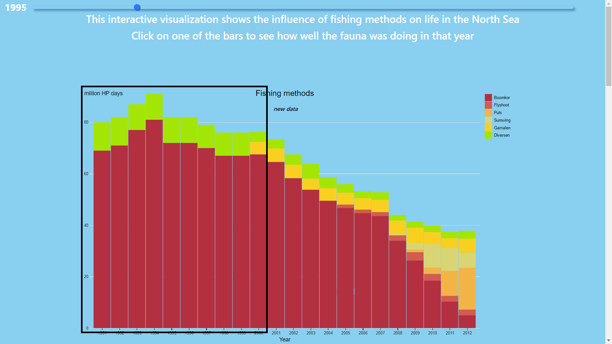
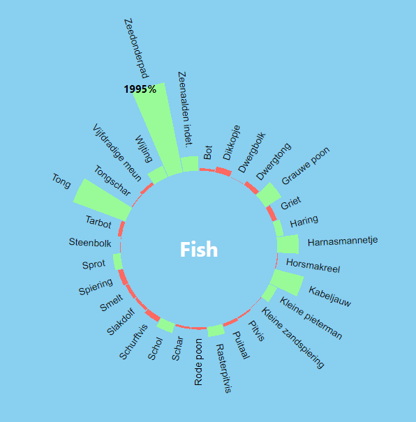

# Log book

## 03/06
Finished a proposal regarding the individual impact of dietary and lifestyle choices on land use, water use and greenhouse gas emissions. Collected data and made a design proposal. However the topic of greenhouse gas emissions was not allowed thus a change of topic had to be made. I researched many different datasets to find a good fit for the final project.

## 04/06
Found a new dataset about different fishing methods that were used in the North Sea. Decided to visualize that dataset against changes in sea fauna per location to assess if there are correlations between increases / decreases in certain fishing methods and the fauna.

## 05/06
Converting all datasets to CSV files in order to process them to JSON files.
Finished technical design, described all functions and my datasets and how I plan to pre-process the datasets for proper usage in D3.

## 06/06
Made a stacked bar chart for the different fishing methods with a colour legend per method.
Also created a horizontal bar chart for the total fauna increase or decrease per location per year.

## 07/06
Created one big JSON file where all the increases and decreases for all individual species per location and per year are put together. Afterwards I integrated this JSON file with my circular bar plot. It is properly working.

## 11/06
Created two select elements, one select element to change the location that updates the total fauna change in a location, the other element to change the species to show the increase or decline for all species belonging to that group in a certain year. Created two update functions, changeCircle() and changeLine(). The former changes the circular bar plot whenever the user changes the species and the last one changes the line graph whenever the user changes location.

## 12/06
The slider is working now to update graphs, fixed bugs with resizing divs. Added responsive titles to all graphs. Colored bars to display increases or decreases.

## 13/06
Succesfully integrated all update functions. Solved all update function bugs.

## 14/06
Found data for fishing methods between 1990 - 2000, and integrated it into my dataset. Added axes labels for the fishing methods graph. Started re-designing my visualizations to be more story-telling. At this point I have a fully working version with all data integrated.

## 17/06
Restructured my project to be in a story-telling way. Every graph now takes up a full page with interactive scroll links in between, now there is room for text between the graphs. The final result should look like below, with every image taking up one full page.

## 18/06
Rewrote horizontal bars update functions so that it doesn't remove everything but instead resets the x and width coordinates of every bar. Also started to select and update the amount of circularbars, as well as the circularbars labels with exit() and remove()

~~~~
const horizontalBars = d3v5.selectAll(".bar")
  .data(locdata)
  .transition()
  .duration(100)
  .attr("x", function(d) {
    if (d.value - 100 >= 0) {
      return width / 2;
    } else {
      return width / 2 - x(100 - d.value);
    }
  })
  .attr("width", function(d) {
    return x(Math.abs(100 - d.value));
  })
~~~~

## 19/06
Made circularbars update with exit and remove instead of deleting all elements. Made all graph titles interactive. Made HTML titles responsive. Changed SVG x and y coordinates to transform so that it is responsive.

~~~~
// Enter append and merge new labels
nieuwelabels.enter()
  .append("g")
  .merge(nieuwelabels)
  .attr("text-anchor", function(d) {
    return (x(d.name) + x.bandwidth() / 2 +
                        Math.PI) % (2 * Math.PI) < Math.PI ? "end" : "start";
  })
  .attr("transform", function(d) {
    return "rotate(" + ((x(d.name) + x.bandwidth() / 2) *
                       180 / Math.PI - 90) + ")" +
                       "translate(" + (y(d['value']) + 10) + ",0)";

// Exit and remove the old labels
nieuwelabels.exit().remove();
~~~~

## 20/06
I fixed a tooltip bug in the circular bar plot to display the value in front of the bars, it looks like such:

I also centred select dropdown menu in the circular bar chart.

Furthermore I repositioned the title of the circular bar plot to be more responsive.

I styled the slider, brought it to the front and made it transparent, this is the current design:

At last I changed most d3v3 functions to d3v5.

## 24/06
Made an transition for the circular bar plot for the bar length, fill colour and the labels. However when the user now changes the slider, the user has to wait for the transition to end. Therefore I disabled the transition again. Now on every on change of the slider the circular bar chart updates immediately. This allows for quick data exploration when the slider is being moved.

I also created a legend for the circular bar plot that shows what the green and red bars mean.

Furthermore I reformatted missing data in the JSON that contains the species occurrence per location.

## 25/06
Created a license, elaborated on readme, put the design and proposal in separate files. In the process of rewriting all d3v3 function to d3v5, one more function is left.
